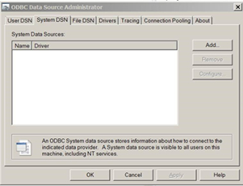

# Modeling Assistance Prioritisation

This project allows to run an assistance targeting categorisation.

The different categories were defined based on the profiling study (**Who?**) and the result of the strategic discussion on targeting (**What?**) and allow to address the question on **How** assistance will be delivered.

This specific project focus on situation where 3 prioritisation categories are defined: 
 * "full.allocation",
 * "reduced.allocation",
 * "no.allocation"

The categories are built from a series of variables collected through a sample-based survey. The objective is to be able to categorise the full population that is registered. The variable to predict comes from the survey while the predictors are the variable collected at registration level.

## Walk-through

The information pulled out from the registration database through `get_data_from_db.R`. [^1]

Data are then reshapped to prevent imbalances within each modalities of the selected variable. This is done in `feature.R`.

The result of a vulnerability survey using measurement of food security is then merged with registration information. In the next step, different models are trained through  `multi-classification-modeling.R`.

The following algorithms are used and compared to generate prediction: 

 * Multinomial logistic regression 
 * Neural Network regression 
 * Gradient Boosted Decision Trees
 * Random Decision Forest
 
The resulting models can be eventually re-trained based on potential categories revision for cases where the targeting committe  would redress cases categorisation.

The model is then applied to the registration registry in order to get the categories for each case: `run-prioritisation.R`

A script `schedule.R` is available to schedule the categorisation script on regular basis within the server - for instance at night...

A reproducible report (using [Rmd](https://www.rstudio.com/wp-content/uploads/2016/03/rmarkdown-cheatsheet-2.0.pdf)) is prebuilt to provide an overview of the the targeting process: `Prioritisation-report.Rmd`

## How to add new variable in the model? 

1. Build the corresponding SQL `SELECT` query . You may test your query first directly within your SQL server. The query must aggregate (`GROUP BY` en SQL) existing information using the `CaseNo` (`ProcessingGroupNumber` within DB schema). If the query use a narrow format, it will need to be converted at a latter stage in a wide format so that `CaseNo` is unique key to execute the join ([What is wide & tall data format?](https://en.wikipedia.org/wiki/Wide_and_narrow_data))

2. Add this new SELECT into the script:  (in this example below, we call it `query.new`) append a new line in the script `extract-query.R`  with something like the following:

> query.new <- "SELECT ProcessingGroupNumber as CaseNO,
>                      BLABLABLA as yourvariable 
>               FROM yourtable 
>               GROUP BY ProcessingGroupNumber "

3. Pull data from this database into the R session using the sqlQuery function in order to create the corresponding data frame . You will need to add a line around line 24 in `get_data_from_db.R`. (in this example below, we call it `newpredictor`). You will need to have [configured your ODBC connection](https://www.techwalla.com/articles/how-to-create-and-setup-an-odbc-database-connection) and set up your passord file `pass.R` before. 

> newpredictor <- sqlQuery(dbhandleprogres, query.new)

In case, `newpredictor` shape is a narrow one (meaning that `CaseNo`  is not unique), you will need to reshape it. In this case, you have a specific variable that you will need to pivot the data (in this example below, we call it `yourvariable`) This is done through an additional line

> newpredictor.wide <- sqlQuery(dbhandleprogres, query5)

If reshape2 is not installed, you need to run
> install.packages("reshape2")

> library(reshape2)
> newpredictor.wide <- dcast(newpredictor, CaseNo ~  yourvariable, value.var = "CaseNo" )

4. Merge data at case level with a new line. 

> merge( x = cases, y = newpredictor, by = "CaseNo", all.x = TRUE )

or incase, the frame was pivoted: 
> merge( x = cases, y = newpredictor.wide, by = "CaseNo", all.x = TRUE )

5. Feature engineering: the objective here is to look at the modalities for the new variable. All of this is done in script  `feature.R`. See potential example below:
 
 First look at the tabulation

> prop.table(table(as.factor(cases$yourvariable), useNA = "ifany"))

  If you have a continuous variable, you will need to create a [discretised version](https://en.wikipedia.org/wiki/Discretization) of it. The decision on the break to be used should allow to have relatively balanced or meaningfull classes. You can use the `cut` function
  
> cases$yourvariable.discrete <- cut(cases$yourvariable,
>                                   breaks = c(0,1,2,3,4,6,50),
>                                   labels = c("Case.1", "Case.2", "Case.3", "Case.4",
                                      "Case.5", "Case.6.or.more"),include.lowest = TRUE)  

 If you have a categoric variable, you may have modalities with very low frequencies or you may have too many modalities. You can re-encode modalities using the following (in this example below, the modality with low frequency is called `rare` and will be merge with another modality called `frequent`) 
 
>  cases$yourvariable[cases$yourvariable == "rare"] <- "frequent"

The last step is to retain your engineered variable in cases2 by adding it in the list at the end of the script
Subset data ready for analysis

> cases2 <- cases[ ,c ("CaseNo",
>
>                 )]

6. Rebuild the prediction model and check their respective accuracy `multi-classification-modeling.R` -- depending on your computer, be warned that this can take some time.... For this, you will need the file train.csv

7. Adjust the prediction script `run-prioritisation.R` that feed the masterlist `progrescase-last.csv` generation together with the report `Prioritisation-report.Rmd`

[^1]: Note an ODBC connection to the Microsoft SQL server where the data is stored shall first configured: this can be set-up through the dedicated windows utilitiy

